# Insurance AI POC - System Architecture & Flow Diagram

## High-Level Architecture

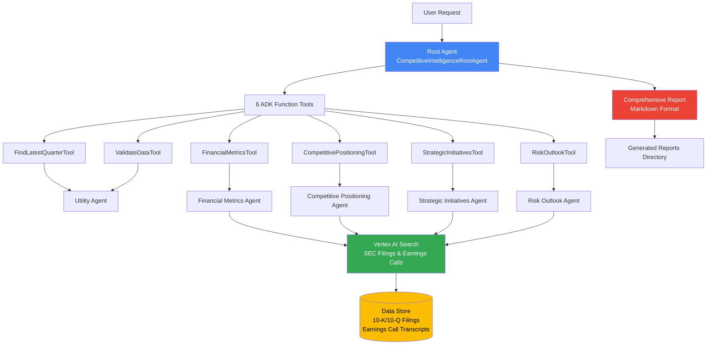

## Data Ingestion Pipeline

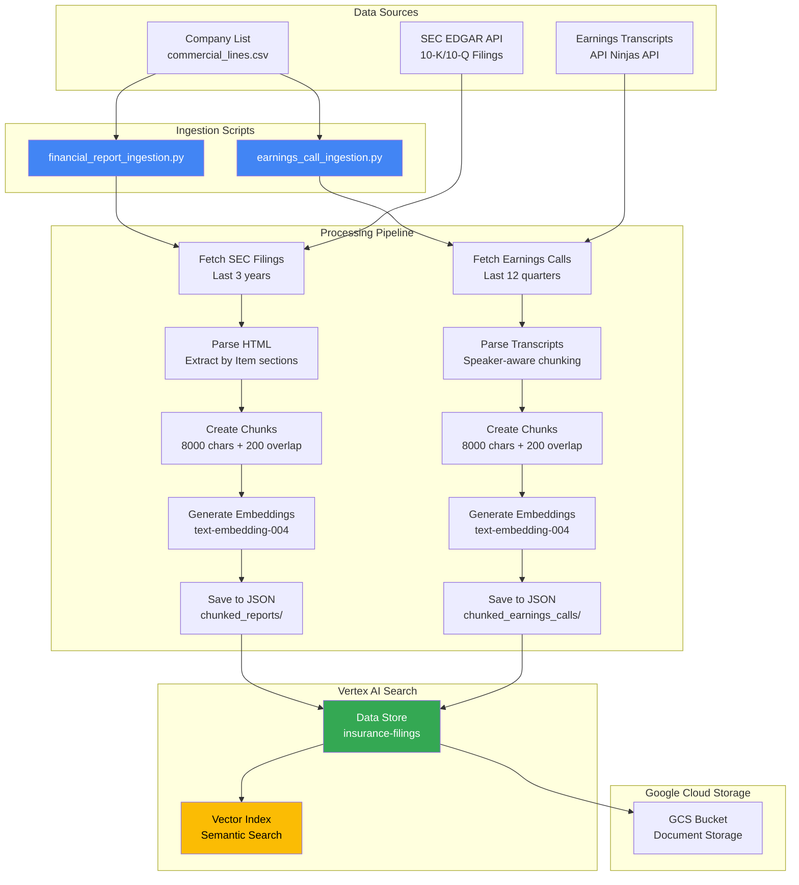

## Ingestion Workflow Details

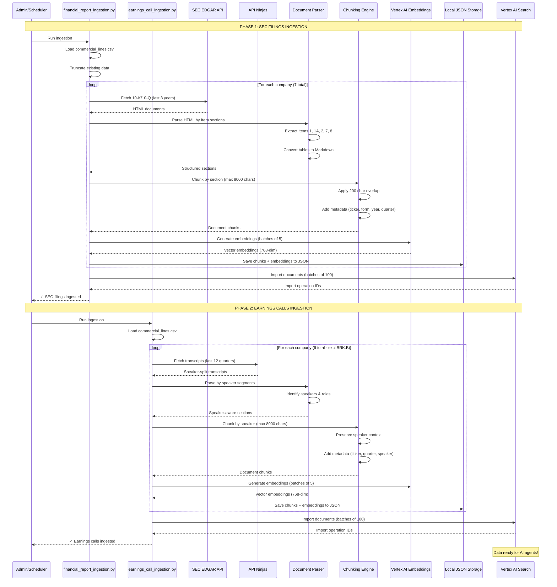

## Detailed Workflow Sequence

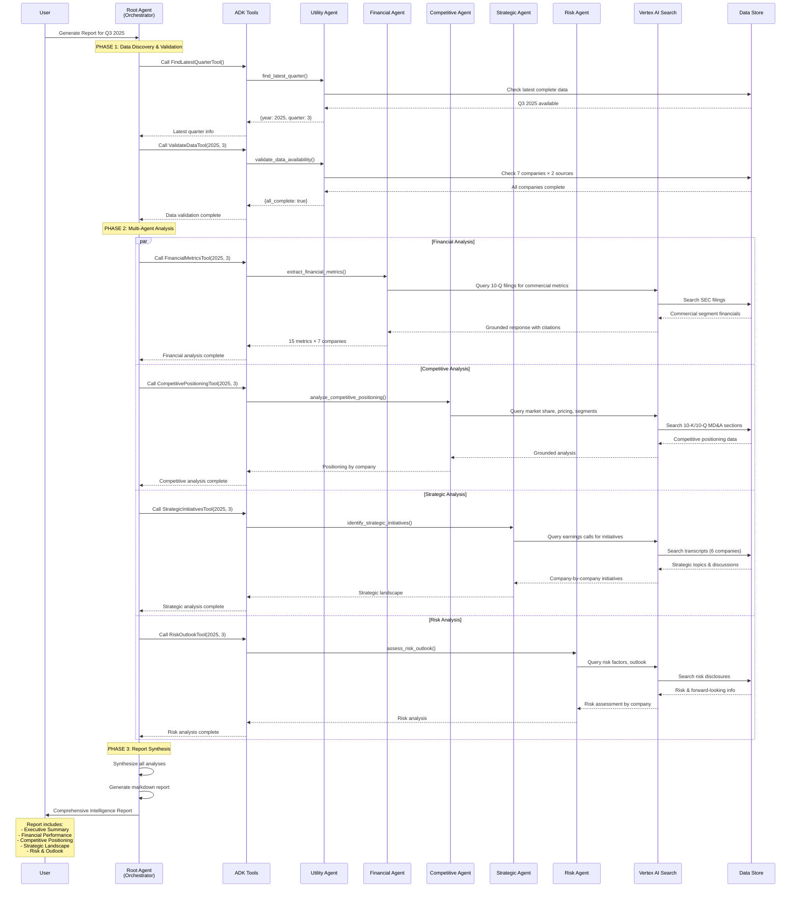

## Agent Architecture Details

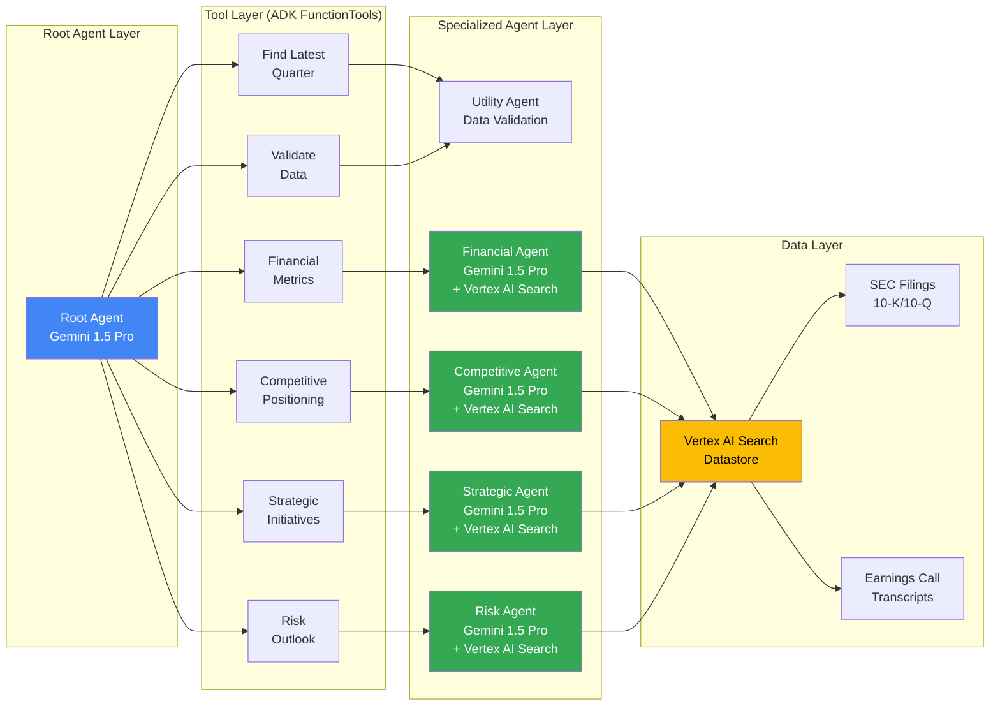

## Data Flow by Analysis Type

```mermaid
graph TD
    subgraph "1. Financial Metrics Analysis"
        FM1[Extract Financial Metrics Tool] --> FM2[Financial Metrics Agent]
        FM2 --> FM3[Query Vertex AI Search:<br/>Commercial segment P&L]
        FM3 --> FM4[SEC 10-Q/10-K filings:<br/>Item 8 Financial Statements<br/>Item 2/7 MD&A]
        FM4 --> FM5[Return 15 metrics × 7 companies:<br/>Written Premiums, Loss Ratio,<br/>Combined Ratio, etc.]
    end
    
    subgraph "2. Competitive Positioning Analysis"
        CP1[Competitive Positioning Tool] --> CP2[Competitive Positioning Agent]
        CP2 --> CP3[Query Vertex AI Search:<br/>Market share, pricing, segments]
        CP3 --> CP4[SEC 10-K/10-Q MD&A:<br/>Item 1 Business Description<br/>Item 7 MD&A Competition]
        CP4 --> CP5[Return positioning analysis:<br/>By company, by product line,<br/>strengths/weaknesses]
    end
    
    subgraph "3. Strategic Initiatives Analysis"
        SI1[Strategic Initiatives Tool] --> SI2[Strategic Initiatives Agent]
        SI2 --> SI3[Query Vertex AI Search:<br/>Earnings call discussions]
        SI3 --> SI4[Earnings Call Transcripts:<br/>6 companies Q&A sessions<br/>Management commentary]
        SI4 --> SI5[Return strategic landscape:<br/>Individual company initiatives<br/>Industry summary]
    end
    
    subgraph "4. Risk & Outlook Analysis"
        RO1[Risk Outlook Tool] --> RO2[Risk Outlook Agent]
        RO2 --> RO3[Query Vertex AI Search:<br/>Risk factors, forward guidance]
        RO3 --> RO4[SEC 10-K Item 1A Risk Factors<br/>10-Q MD&A forward-looking<br/>Earnings call guidance]
        RO4 --> RO5[Return risk assessment:<br/>By company, industry risks,<br/>Hartford risk profile]
    end
    
    style FM1 fill:#e8f4f8
    style CP1 fill:#e8f4f8
    style SI1 fill:#e8f4f8
    style RO1 fill:#e8f4f8
    
    style FM5 fill:#d4edda
    style CP5 fill:#d4edda
    style SI5 fill:#d4edda
    style RO5 fill:#d4edda
```

## Document Processing & Chunking Strategy

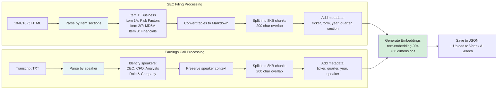

## Companies & Data Sources Matrix

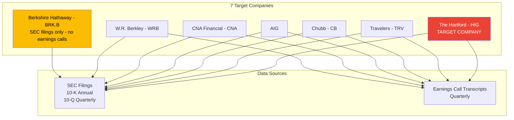

## Report Output Structure

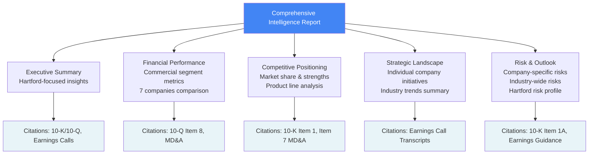

## Technology Stack

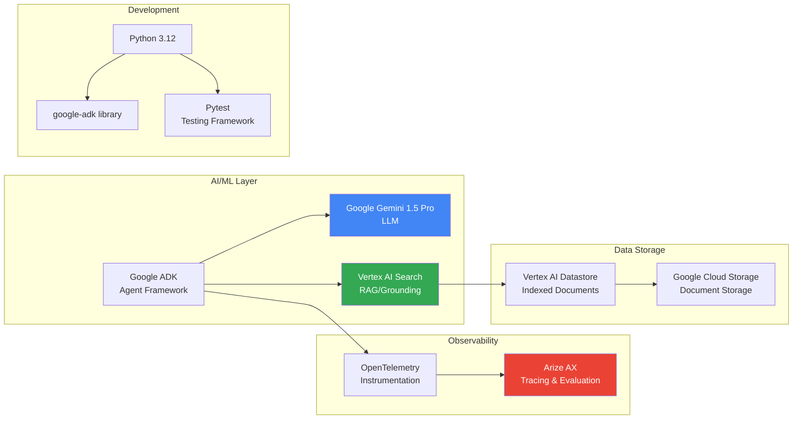

## Execution Flow States

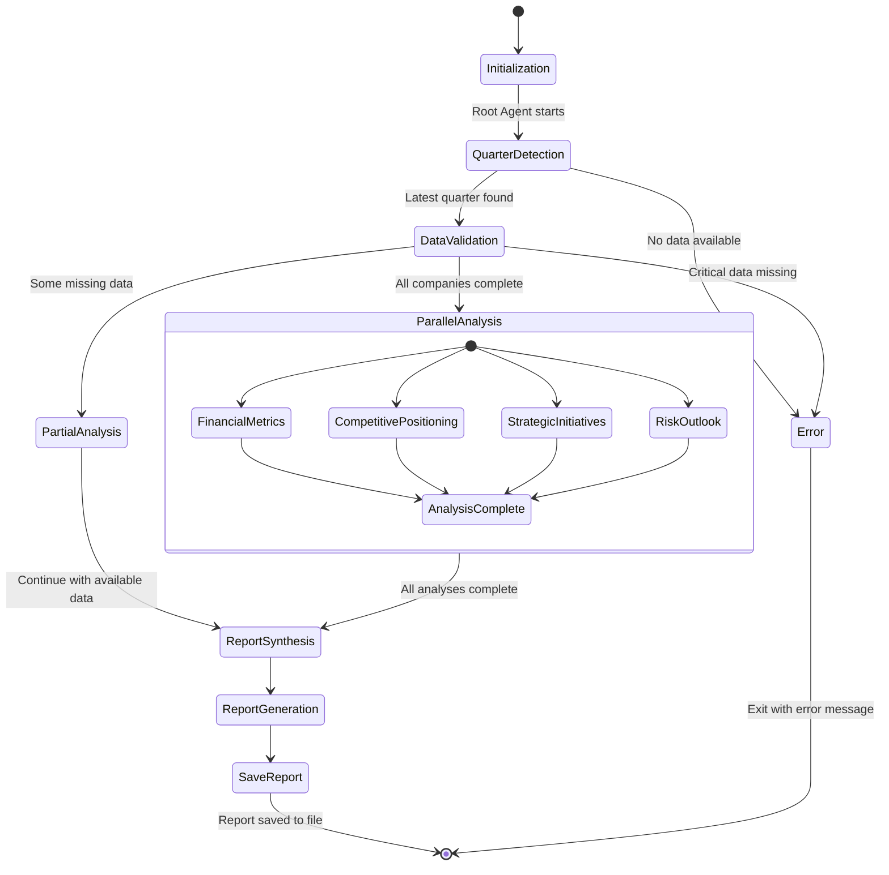

## Ingestion Pipeline Details

### Data Collection
- **SEC Filings Source**: SEC EDGAR API (free, public data)
- **Earnings Calls Source**: API Ninjas API (paid: $39/month for 100K requests)
- **Historical Depth**: Last 3 years of data
- **Update Frequency**: Quarterly (post earnings releases)

### Chunking Strategy
- **Chunk Size**: 8,000 characters (optimal for LLM context window)
- **Overlap**: 200 characters (maintains context continuity)
- **SEC Filings**: Chunked by Item sections (preserves document structure)
- **Earnings Calls**: Chunked by speaker segments (preserves speaker context)

### Metadata Enrichment
Each chunk includes:
- **Company Info**: Ticker, name, industry
- **Document Type**: 10-K, 10-Q, or Earnings Call
- **Time Period**: Year, quarter, filing date
- **Structure**: Section/Item number, speaker name/role
- **Content Summary**: Brief description for improved retrieval
- **Source URL**: Link back to original SEC filing

### Embedding Generation
- **Model**: Vertex AI `text-embedding-004`
- **Dimensions**: 768 (high-quality semantic understanding)
- **Batch Size**: 5 chunks per API call (API limit)
- **Purpose**: Enable semantic search & hybrid retrieval

### Storage & Indexing
- **Local Storage**: JSON files with chunks + embeddings
- **Cloud Storage**: GCS bucket for document persistence
- **Vector Index**: Vertex AI Search with hybrid retrieval
- **Reconciliation**: Incremental mode (upsert new, keep existing)

### Ingestion Scripts

#### `financial_report_ingestion.py`
- Fetches 10-K/10-Q filings from SEC EDGAR
- Parses HTML and extracts Item sections
- Converts tables to Markdown for better comprehension
- Chunks by section with metadata
- Generates embeddings
- Imports to Vertex AI Search

#### `earnings_call_ingestion.py`
- Fetches transcripts from API Ninjas
- Parses speaker-split format
- Preserves speaker context (CEO, CFO, Analysts)
- Chunks by speaker segments
- Generates embeddings
- Imports to Vertex AI Search

### Data Volume
- **7 Companies** × **3 Years** × **5 Filings/Year** = ~105 SEC documents
- **6 Companies** × **12 Quarters** = ~72 Earnings call transcripts
- **Total Documents**: ~177 source documents
- **Total Chunks**: ~3,000-5,000 searchable chunks
- **Storage**: ~50-100 MB compressed

## Key Features

### 🎯 Commercial Insurance Focus
- **Exclusively analyzes Commercial Lines/Business Insurance segment**
- Excludes Personal Lines, Life Insurance, Health Insurance
- Key product lines: Workers Compensation, General Liability, Commercial Property, Commercial Auto, Professional Liability

### 🏢 Company Coverage
- **Primary Target**: The Hartford (HIG)
- **Competitors**: Travelers, Chubb, AIG, CNA, W.R. Berkley, Berkshire Hathaway
- **Total**: 7 major commercial insurance companies

### 📊 Data Sources
- **SEC Filings**: 10-K annual reports, 10-Q quarterly reports
- **Earnings Calls**: Quarterly earnings call transcripts (6 companies - BRK.B excluded)
- **Grounding**: Vertex AI Search ensures all claims are cited

### 🔍 Analysis Dimensions
1. **Financial Metrics**: 15+ commercial segment metrics per company
2. **Competitive Positioning**: Market share, strengths, product lines
3. **Strategic Initiatives**: Company-by-company strategic moves + industry trends
4. **Risk & Outlook**: Company-specific and industry-wide risk assessment

### 📝 Citations
- **Detailed SEC Filing Citations**: Part I Item 1, Item 2 MD&A, Item 7, Item 8 Notes
- **Earnings Call Citations**: Specific topics and speakers
- **Page-level references** for all claims

### 🔬 Observability
- **Arize AX Integration**: Full tracing of all agent executions
- **OpenTelemetry**: Instrumentation for Google ADK
- **Performance Metrics**: Token usage, latency, success rates

### ✅ Testing
- **30 Integration Tests**: Comprehensive pytest suite
- **Test Coverage**: Tool trajectories, grounding, full report generation
- **Timeout Handling**: 10-minute timeout for full reports
- **Commercial Focus Validation**: Ensures no personal lines leakage

## Performance Characteristics

- **Full Report Generation**: 4-10 minutes
- **Individual Agent Execution**: 30-120 seconds each
- **Parallel Analysis**: Financial, Competitive, Strategic, Risk agents run independently
- **Token Usage**: ~78,000 tokens for successful full report
- **Report Size**: ~5,000-15,000 characters (comprehensive analysis)

## Error Handling

- **Missing Data**: Graceful degradation with partial reports
- **JSON Parsing Errors**: Fallback schemas ensure continued execution
- **Timeout Management**: Individual agent and full report timeouts
- **Retry Logic**: Automatic retry with exponential backoff
- **Validation**: Pre-flight data availability checks

---

**Last Updated**: November 18, 2025  
**Project**: Insurance AI POC - Commercial Insurance Competitive Intelligence  
**Framework**: Google ADK (Agent Development Kit)
